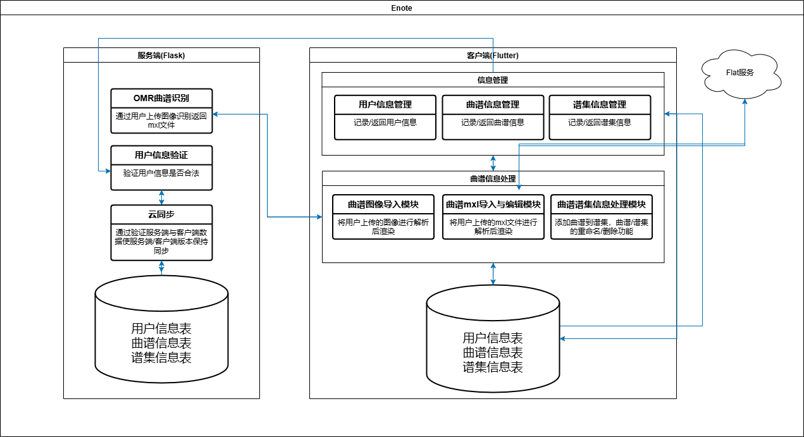
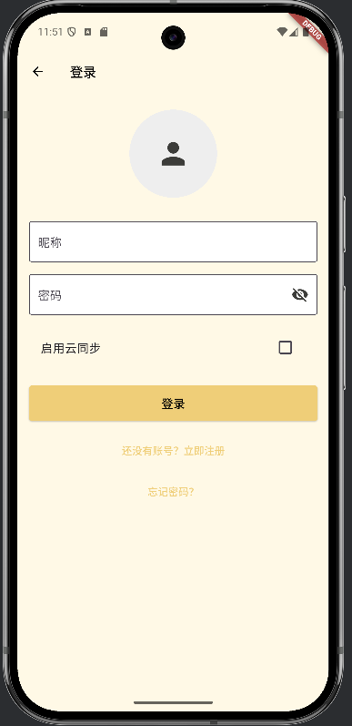
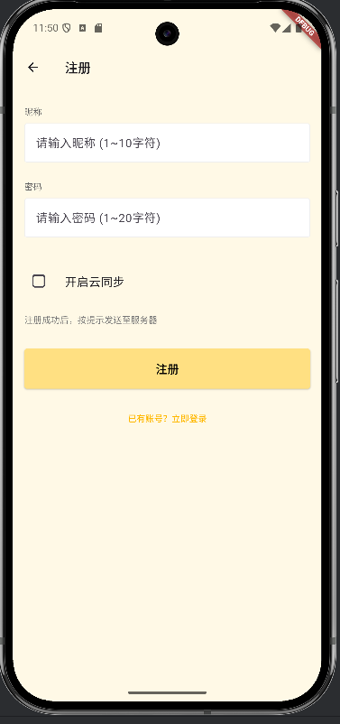
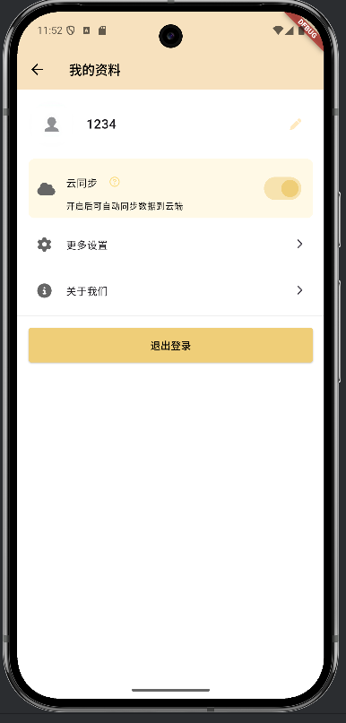
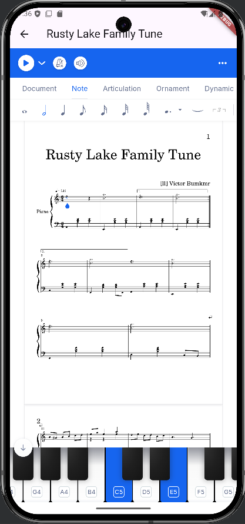
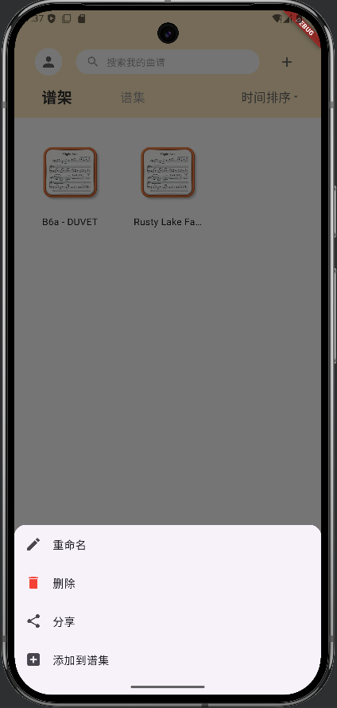
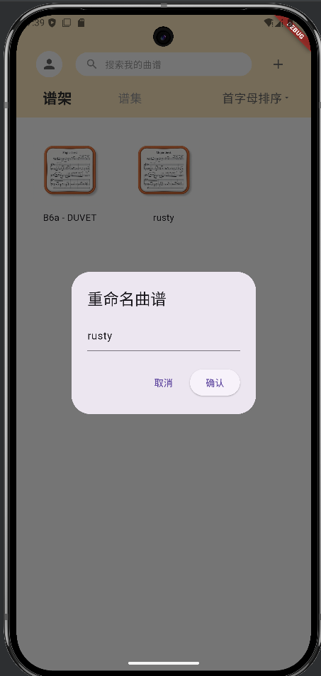
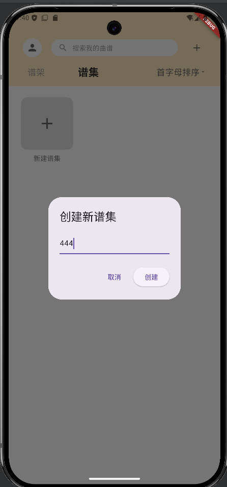

# Enote曲谱编辑移动端软件（Flutter + Flask）

本项目是一款跨平台移动应用，支持用户导入、编辑、管理及云同步音乐曲谱（支持 MXL 格式）。前端基于 Flutter 开发，后端使用 Flask 提供用户认证、OMR（光学识谱）、曲谱数据同步等服务。

---
## 目录

- [功能特性](#-功能特性)
- [界面预览](#-界面预览)
- [环境配置](#-环境配置)


---

## ✨ 功能特性

### 曲谱管理
- 支持导入 MXL 文件或通过图像自动识谱导入（OMR）
- 可视化曲谱编辑器（内嵌 Flat Web 编辑器）
- 曲谱重命名、删除、排序（时间/首字母）

### 谱集管理
- 支持创建、命名谱集
- 曲谱可添加进多个谱集，支持按谱集分类浏览

### 云同步
- 自动或手动同步曲谱至服务器
- 支持服务器与本地的修改时间比对及冲突处理
- 云端使用 MongoDB 存储文件与元数据

### 用户系统
- 注册 / 登录 / 注销 / 重置密码
- 支持编辑昵称与密码
- 支持“是否开启云同步”开关

### 其他
- 夜间模式切换
- 本地数据库：SQLite + sqflite
- 本地用户状态保持：SharedPreferences

### 项目结构图


---
## 界面预览

### 登录页面
简洁直观的登录入口，支持云同步开关与密码找回功能  


### 注册页面
支持昵称、密码填写与云同步配置，视觉层次清晰，注册引导明确  


### 个人主页（我的资料）
展示用户昵称、云同步开关、更多设置与退出入口，布局清爽  


### 乐谱导入界面
支持图像/MXL导入，顶部提供搜索与分类切换，快速管理曲谱资源  


### 谱架主页面
支持曲谱展示、排序、搜索与批量导入，是曲谱管理主场景  


### 乐谱编辑器
基于 WebView 的 MusicXML 编辑器，支持音符、力度等可视化编辑  



### 曲谱操作菜单（长按弹出）
快速重命名、删除、添加到谱集等操作，提升管理效率  



### 曲谱重命名弹窗
支持直接修改标题，交互明确  


### 谱集创建页面
极简表单风格，仅输入名称即可新建谱集，操作顺畅  


## 环境配置

### 克隆仓库源码

`git clone https://github.com/BUJIQI/Enote.git `


### 客户端

- 推荐开发环境：Android Studio  
  安装地址：[https://developer.android.com/studio?hl=zh-cn](https://developer.android.com/studio?hl=zh-cn)  


- Flutter SDK 安装  
  访问 [Flutter 官网](https://docs.flutter.dev/get-started/install/windows/mobile)，安装后在 Android Studio：
  - 设置中启用 Flutter 插件
  - Language & Frameworks 中配置 Flutter SDK 路径
  - 系统变量 Path 添加 Flutter/bin 路径

- JDK 安装与配置（用于构建安卓应用）：  
  下载地址：[https://adoptium.net/zh-CN/temurin/releases/?version=17](https://adoptium.net/zh-CN/temurin/releases/?version=17)  
  修改 `Enote/client/android/gradle.properties` 中配置：
  ```
  org.gradle.java.home=你的jdk地址
  ```

- Flutter 项目依赖与运行：
  ```bash
  flutter pub get  # 下载依赖
  flutter run      # 启动调试
  ```
  > 如下载卡顿，可通过 File → Settings → HTTP Proxy 设置代理

- 启动 Android 模拟器：
  - 点击右侧栏图标 Device Manager → “+” Create Virtual Device
  - 推荐系统版本 Android 15.0+

- 后端地址配置：
  - 测试本地服务端，后端地址为 `10.0.2.2`
  - 若访问远程服务器，需要修改服务器地址

---

### 服务端

- 切换工作目录至 server：
  ```bash
  cd server
  ```
- 安装依赖：
  ```bash
  pip install -r requirements.txt -i https://pypi.tuna.tsinghua.edu.cn/simple
  ```
- 运行服务端：
  ```bash
  python run.py
  ```
---

## 🎯 技术栈

| 前端（Flutter） | 后端（Python） | 数据库        | OMR引擎     |
|------------------|----------------|----------------|--------------|
| Flutter      | Flask          | SQLite + MongoDB  | Audiveris + OpenCV |

---

## 📸 截图预览

> 可视化编辑界面、曲谱展示、谱集管理、主题切换等页面待补充...


